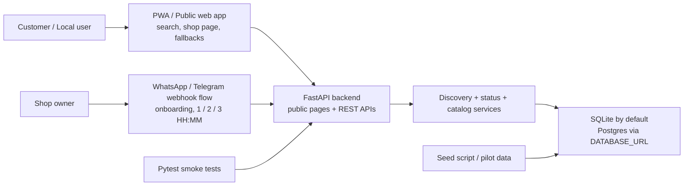

# NammaOpen

NammaOpen is a Bengaluru-first MVP for checking whether a physical shop is open right now. This repo includes a runnable FastAPI backend, a built-in mobile-first PWA, onboarding/status bot webhooks, pilot seed data, and smoke tests.

## Block diagram

## What is live in this repo
- Public web app at `/` with search, shop detail pages, service pricing, and fallback suggestions.
- REST API for shops, status updates, search, reopen subscriptions, payments, and bot webhooks.
- WhatsApp/Telegram-style webhook handlers for onboarding and daily `1` / `2` / `3 HH:MM` commands.
- Local zero-setup database path using SQLite by default.
- Pilot seed data for Bengaluru tailors and salons.

## Quick start
1. Open a terminal in `backend`.
2. Install dependencies: `python -m pip install -r requirements.txt`
3. Copy `.env.example` to `.env` if you want to override defaults.
4. Seed pilot data: `python scripts/seed_pilot.py`
5. Start the app: `uvicorn app.main:app --reload`
6. Open `http://localhost:8000` for the PWA or `http://localhost:8000/docs` for API docs.

## Local stack choices
- Local default: SQLite database at `backend/nammaopen.db`
- Production-ready override: set `DATABASE_URL` to Postgres in `.env`
- Optional infra scaffold: `infra/docker-compose.yml` is still present if you want Postgres + Redis later

## Verification
- Run tests from `backend`: `python -m pytest`
- Seed data includes multiple same-category shops so fallback recommendations show up immediately.

## Next production steps
- Add provider-authenticated WhatsApp and Telegram signature verification.
- Swap placeholder UPI plan links for your actual payment workflow.
- Add background delivery for reopen notifications.
- Add auth, audit logging, and rate limiting before public launch.
